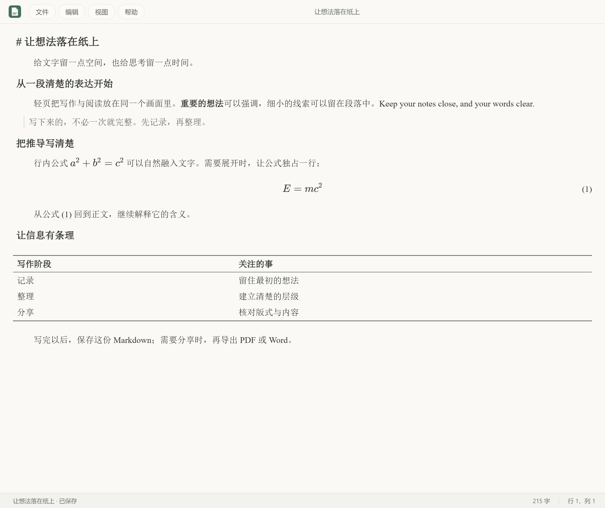
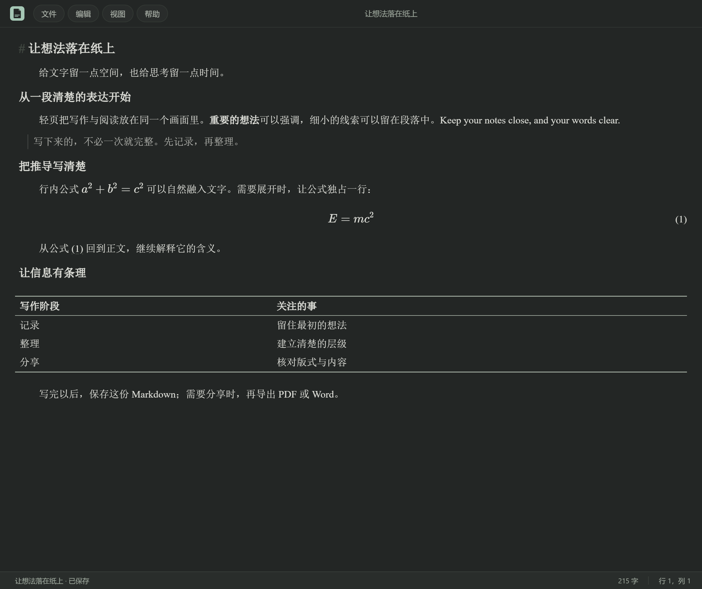
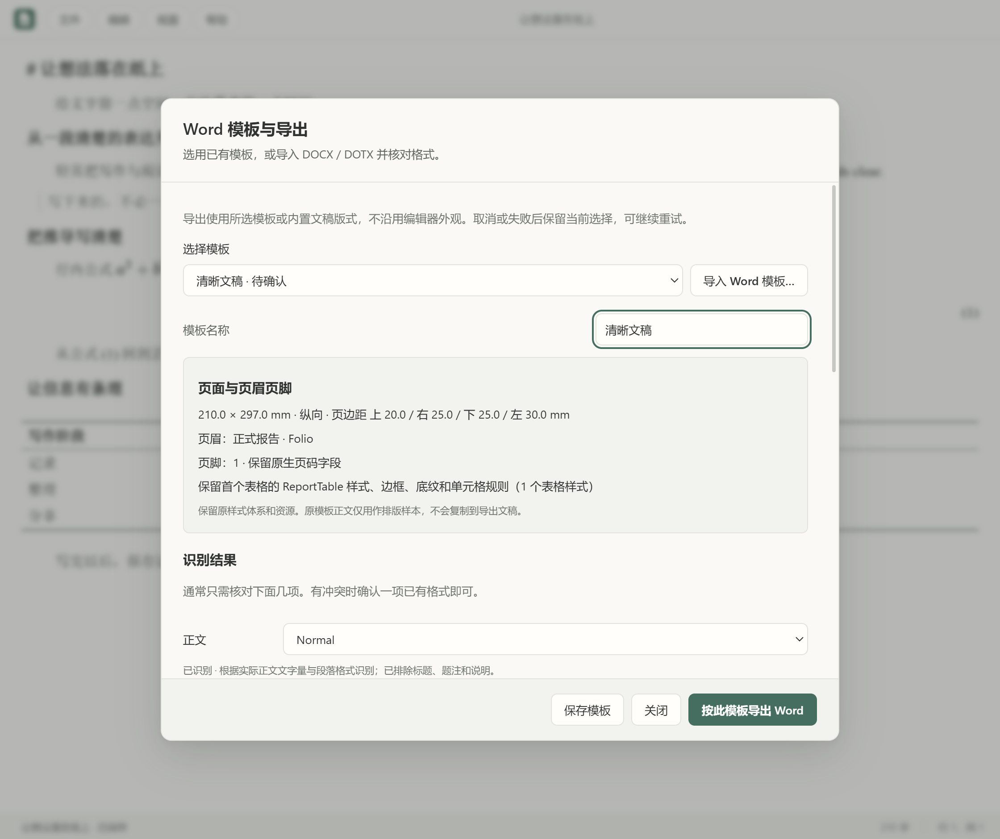

简体中文 · <a href="README.en.md">English</a>

<picture>
  <source media="(prefers-color-scheme: dark)" srcset="docs/images/hero-dark.svg">
  
</picture>

  <strong>一款在本机专注写作的 Markdown 编辑器。</strong> 
  让标记在需要时出现，让文字在阅读时回归清楚。写完，再带着版式导出。

  <a href="#下载安装">下载安装</a> ·
  <a href="docs/USER_GUIDE.md">使用指南</a> ·
  <a href="docs/DEVELOPMENT.md">参与开发</a> ·
  <a href="SUPPORT.md">问题反馈</a>

<code>1.2.0 发布候选</code> &nbsp; <code>Windows 11 · x64 已验证</code> &nbsp; <a href="LICENSE">MIT</a>

<picture>
  <source media="(prefers-color-scheme: dark)" srcset="docs/images/writing-dark.png">
  
</picture>

## 写作时，少一点打扰

- **一份文稿，一个画面。** 直接写 Markdown；光标所在段落显示标记，离开后呈现阅读样式。目录帮助你在长文中定位。
- **公式、表格与图片。** 支持 LaTeX 公式、表格、本地图片、编号与交叉引用，适合笔记和技术文稿。
- **把成稿带出去。** 导出 PDF 或可编辑的 Word 文档，选择内置版式，也可以导入 DOCX／DOTX 模板并核对格式映射。
- **保留你的阅读节奏。** 浅色与深色界面，字体、字号、行距和强调色可调整；写作外观与导出版式分别设置。
- **照顾未保存的文字。** 未保存确认、本地恢复草稿和外部文件修改检查，让保存状态更清楚。草稿仍不能替代手动保存。
- **文件留在你手里。** 没有内置账号、云同步、遥测或自动更新服务。文稿保存到你选择的位置。

<strong>看看深色写作与 Word 模板</strong>

这三张图来自实际运行的 1.2.0 应用，使用同一份[示例文稿](docs/examples/quiet-writing.md)，展示现有界面。

## 下载安装

**当前为 1.2.0 预发布版。** 前往 [GitHub Releases](https://github.com/JDEgg-Bing/Folio/releases/tag/v1.2.0)，下载 `Folio-1.2.0 Setup.exe` 和 `SHA256SUMS.txt`。预发布版适合试用和反馈，已知验证范围见下文。

1. 按[安装指南](docs/INSTALLATION.md)核对校验值，再运行安装包。
2. 跟随中文向导选择安装位置和可选的桌面快捷方式；默认按当前用户安装，无需管理员权限。
3. 打开轻页，开始写作。安装会加入 Markdown 文件的“打开方式”，默认编辑器由你在 Windows 中选择。

安装包尚未代码签名，Windows 可能显示安全提示；校验值用于确认下载文件与发布文件一致，不代替发布者身份验证。Windows 11 x64 已验证，其他 Windows 版本、ARM、macOS 和 Linux 尚未验证。

升级使用新安装包；卸载保留文稿、图片附件、设置、模板与恢复草稿。[安装、升级、卸载与数据位置说明](docs/INSTALLATION.md)

## 三步开始

1. 新建或打开 `.md`／`.markdown` 文件，直接输入 Markdown。
2. 用 **Ctrl+S** 保存；包含托管图片的文稿，分享时一起带上同名 `.assets` 文件夹。
3. 从“文件”菜单导出 PDF 或 Word，选择版式并检查成稿。

常用操作：**Ctrl+O** 打开 · **Ctrl+F** 查找／替换 · **Ctrl+Shift+O** 目录 · **F1** 使用指南。

## 数据与隐私

文稿保存在你选择的位置；设置、模板和恢复草稿默认位于 `%APPDATA%/Markdown Editor`。这个历史目录名称用于兼容已有资料。卸载不会主动清除这些数据。

应用没有内置上传文稿或遥测服务。文稿里的外部链接、远程图片，以及下载或开发安装依赖所产生的网络访问，仍需按各自来源判断。提交反馈前，请移除文稿、截图和日志中的私密内容。[完整使用说明](docs/USER_GUIDE.md)

## 当前边界

- 当前为单文稿窗口；多标签、文件工作区、云同步和自动更新尚未提供。
- 本地恢复草稿不能保证断电前最后一小段输入；外部修改提示不提供自动合并或跨程序写锁。
- Word 模板不完整重建特殊封面、多节、多栏与浮动对象；电脑上的字体和 Word 版本可能改变分页。
- 实际旧 Squirrel 1.0.0 迁移、真实中文输入法、多显示器物理 DPI、第二台电脑及持续试用仍待验证。

查看[版本变化](CHANGELOG.md)、[验收范围](docs/RELEASE_ACCEPTANCE.md)和[路线图](ROADMAP.md)。

## 一起改进轻页

使用问题见[支持说明](SUPPORT.md)；错误和建议通过 [GitHub Issues](https://github.com/JDEgg-Bing/Folio/issues/new/choose) 提交。欢迎改进文档、排版、可访问性与文稿保护。

开发前请阅读[贡献指南](CONTRIBUTING.md)、[开发指南](docs/DEVELOPMENT.md)和[行为准则](CODE_OF_CONDUCT.md)。安全问题请按[安全政策](SECURITY.md)私密报告。

## 许可证与致谢

Folio 自有代码、文档与品牌图片使用 [MIT License](LICENSE)。Copyright © 2026 Folio Contributors。

感谢 Electron、React、CodeMirror、KaTeX 等开源项目。第三方组件保留各自许可证；Word 公式转换依赖 mathml2omml，采用 **LGPL-3.0-or-later**，不因本项目采用 MIT 而改变。[第三方组件声明](THIRD_PARTY_NOTICES.md)
