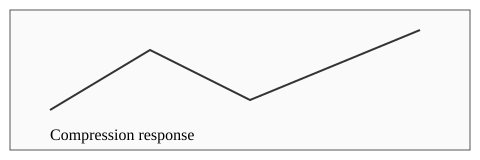

# 正式文稿排版验证 {#sec:report}

本报告用于验证个人写作工具的正式导出版式。中文段落保持舒适的行距、两字首行缩进与合理的页面密度，中英文混排中的 Compression and torsion response 与行内公式 $E=mc^2$ 应自然融入正文。报告需要适合长时间阅读和纸面打印。

This technical report compares measured responses with an analytical model. Typography should support sustained reading, while figures, equations, and tables remain clearly connected to the surrounding discussion. English paragraphs use a serif font and do not require a Chinese first-line indent.

## 研究方法 {#sec:methods}

采用 **理论计算与实验对照** 的方法比较材料响应。参见 [@fig:device]、[@tbl:parameters] 和 [@eq:energy]。行内代码 `stiffness_ratio` 保持轻微的字体差异，*说明文字* 与普通正文保持协调。

{#fig:device}

| 序号 | 技术描述 Technical description | 数值 | 公式 |
| --- | --- | --- | --- |
| 1 | 压缩 response 与边界条件的关系 | 210 MPa | $x^2$ |
| 2 | 扭转 torsion 的理论模型与实验结果比较 | -1.25 | $\frac{a}{b}$ |
| 3 | 短说明 | 2e-3 | $\sqrt{x}$ |
{#tbl:parameters}

$$
E = mc^2
$$
{#eq:energy}

### 理论模型

建立如下关系式。公式主体居中，编号位于右侧，与普通正文保持适当距离。

\[
\begin{aligned}
\sigma &= E\varepsilon \\
F &= kx
\end{aligned}
\]

> 引用说明：结果应在一致的边界条件下比较。引用采用克制的缩进与细线，使它成为正文的一部分。
>
> A reference passage remains readable without dominating the surrounding text.

1. 首先记录加载条件。
2. 检查参数与理论模型。
   - 比较重复测量结果。
   - 记录实验误差。
3. 最后形成结论。

#### 计算示例

```ts
const stiffness = force / displacement;
const description = "Long identifiers should wrap within the printable area rather than overflow into the page margin.";
return { stiffness, description };
```

# 结果与讨论

正文中的一级标题保留章节性质，首页主标题使用独立的文档标题样式。后续长表格、长代码和长文本用于验证分页。
